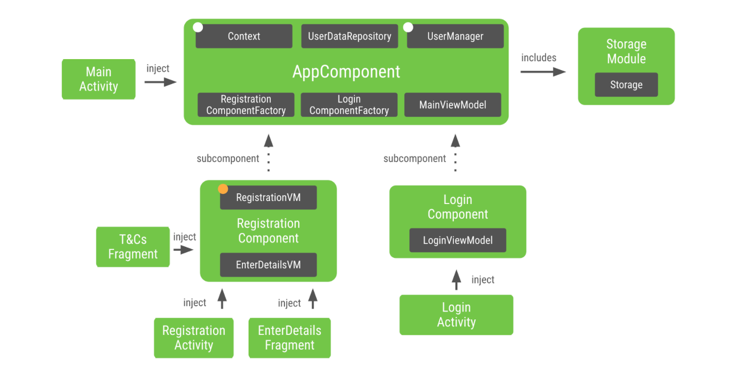

[](https://developer.android.com/reference)
[](https://codecov.io/gh/androidle/testing-demo)
# Testing Demo

## Samples - Kotlin
|     Sample     | Description |
| ------------- | ------------- |
| [master](https://github.com/androidle/testing-demo/tree/main) | The base for the rest of the branches.<br/>Uses MockWebServer |
| [dagger-android](https://github.com/androidle/testing-demo/tree/dagger-android) | A simple Dagger setup that uses `dagger-android`|
| [hilt](https://github.com/androidle/testing-demo/tree/hilt) | A simple  `hilt` setup |
| [mockWebServer_https_base_hilt](https://github.com/androidle/testing-demo/tree/mockWebServer_https) | A simple MockWebServer `https` setup |

## Table of Contents

- [Introduction](#introduction)
- [Testing](#testing)
- [Demo](#demo)
- [Libraries](#Libraries)
- [Plugins](#Plugins)
- [Others](#Others)

## Introduction

This project is to show the practice testing on android

## Testing

* Testing app on Android [Google training](https://developer.android.com/training/testing)
* Unit testing refers [javaJunitExamples](http://www.javabyexamples.com/tag/junit)
* Instrumentation testing
  with [MockWebServer](https://github.com/square/okhttp/tree/master/mockwebserver)
* Screenshot testing
  with [screenshot-tests-for-android](https://github.com/facebook/screenshot-tests-for-android)
* Improve espresso tests
  with [Robot Pattern](https://academy.realm.io/posts/kau-jake-wharton-testing-robots)

## Demo

## Libraries

- [Espresso](https://developer.android.com/training/testing/espresso)
- [MockWebServer](https://github.com/square/okhttp/tree/master/mockwebserver)
- [screenshot-tests-for-android](https://github.com/facebook/screenshot-tests-for-android)
- [Dagger2](https://dagger.dev/)
  
  1.The target reference  that from the
  codelab [android-dagger](https://developer.android.com/codelabs/android-dagger)
  
## Plugins

* Code coverage with [jacoco](https://github.com/jacoco/jacoco)
* Code scan with [sonarqube](https://github.com/SonarSource/sonar-scanning-examples)

    1. how to integrate for gradle refers
       to [sonarscanner-for-gradle](https://docs.sonarqube.org/latest/analysis/scan/sonarscanner-for-gradle/)
    2. To generate a report, we need to run a gradle command:
  ```
  ./gradlew :journeylib:jacocoTestReport sonarqube -Dsonar.host.url=http://localhost:9000/
  ```
* Publish android
  artifact [maven-publish-plugin](https://docs.gradle.org/current/userguide/publishing_maven.html)

    1. Google
       doc [Use the Maven Publish plugin](https://developer.android.com/studio/build/maven-publish-plugin)
    2. Code gist refers
       to [maven-publish-gradle](https://gist.github.com/Robyer/a6578e60127418b380ca133a1291f017)

* Code style with [ktlint](https://ktlint.github.io/)

## Others

### theme

- [android themes and styles](https://developer.android.com/guide/topics/ui/look-and-feel/themes)
- [Android Styling: Common Theme Attributes](https://medium.com/androiddevelopers/android-styling-common-theme-attributes-8f7c50c9eaba)
